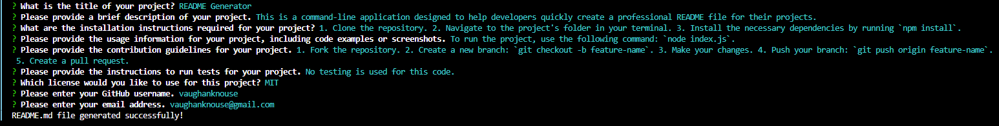
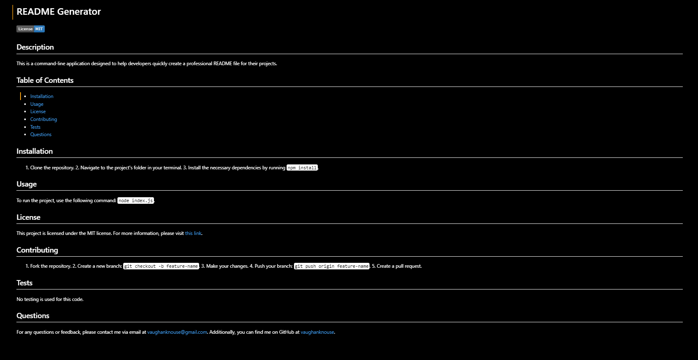

# Node.js - Professional README Generator

## Description

Creating a well-structured README file is essential for any project, but it can be time-consuming and tedious. To address this, this week’s UT Austin Coding Bootcamp challenge involved modifying starter code to create a Professional README Generator using Node.js, npm, and the Inquirer package.

The Node.js Professional README Generator is a command-line application designed to help developers quickly and easily create a high-quality, professional README.md file for their projects. This tool simplifies the process of creating a README.md file by dynamically generating a professional README file based on a user’s input, utilizing the Inquirer package for an interactive and user-friendly experience that is simple and straightforward making it accessible for developers of all skill levels. Through interactions with the user via prompts provided by the Inquirer package, the user inputs specific information about a project into the command-line, which is then automatically formatted and placed into a structured and visually appealing markdown README.md document. This newly created, well-organized README file includes essential sections such as Title, Description, Table of Contents, Installation, Usage, License, Contributing, Tests, and Questions. Users are also able to customize their README files by providing specific details for each section during the input process to fit their project’s needs. By automating the README file creating process, ensuring consistency, and saving developers valuable time, this application can help developers focus more on building projects and less on writing documentation.

The motivation for creating this application was to streamline the process of creating professional README files for projects. By automating the generation of README files, developers can save time and ensure consistency in the structure and content of their project documentation. This README generator tool helps developers quickly create informative README files that provide essential information about their projects, which then facilitates collaboration by making it easier for others to understand and use their code.

Working with the Node.js Professional README Generator application not only helps developers create professional documentation for their projects but also enhances their understanding of various concepts and best practices in full stack application development. Overall, the Node.js Professional README Generator simplifies the process of creating comprehensive and well-structured README files, helping developers effectively communicate the purpose, features, and usage of their projects.


## User Story

```md
AS A developer
I WANT a README generator
SO THAT I can quickly create a professional README for a new project
```

## Acceptance Criteria

```md
GIVEN a command-line application that accepts user input
WHEN I am prompted for information about my application repository
THEN a high-quality, professional README.md is generated with the title of my project and sections entitled Description, Table of Contents, Installation, Usage, License, Contributing, Tests, and Questions
WHEN I enter my project title
THEN this is displayed as the title of the README
WHEN I enter a description, installation instructions, usage information, contribution guidelines, and test instructions
THEN this information is added to the sections of the README entitled Description, Installation, Usage, Contributing, and Tests
WHEN I choose a license for my application from a list of options
THEN a badge for that license is added near the top of the README and a notice is added to the section of the README entitled License that explains which license the application is covered under
WHEN I enter my GitHub username
THEN this is added to the section of the README entitled Questions, with a link to my GitHub profile
WHEN I enter my email address
THEN this is added to the section of the README entitled Questions, with instructions on how to reach me with additional questions
WHEN I click on the links in the Table of Contents
THEN I am taken to the corresponding section of the README
```

## Installation
To install the Node.js Professional README Generator, follow the following steps:
1.	Clone the repository to your local machine: `git clone https://github.com/vaughanknouse/nodejs-readme-generator.git`.
2.	Ensure that the current version of Node.js is installed. 
3.	Open the cloned repository in a CLI, such as Visual Studio Code.
4.	Navigate to the project directory in your terminal. 
5.	Initialize a project with `package.json` by typing `npm init -y` in the terminal.
6.	Install `inquirer` version 8.2.4 by typing `npm inquirer@8.2.4` in the terminal.
7.	Install other necessary dependencies by typing `npm i` in the command line to ensure that the `node-modules` folder is operating on your local device. 


## Usage
To use the Node.js Professional README Generator, follow the following steps:
1.	Once the dependencies are installed, initialize the application with node.js by running the `index.js` file using the following command: `node index.js`.
2.	The application will prompt you to enter information about your project, such as the project title, description, installation instructions, usage information, contribution guidelines, test instructions, license, GitHub username, and email address.
3.	Follow the `npm inquirer` prompt questions through sequential order within the directory and provide details for each section of the README.md file.
4.	After providing all the necessary information, the application will generate a professional README.md file named `README-generated.md` based on your input.
5.	Once the new README is generated, review it to ensure all the information is correctly included in the different sections.
6.	At your discretion, you may customize the `README-generated.md` file to fit your project’s needs. 
7.	In the future, you may also alter the prompted questions within the `index.js` and `generateMarkdown.js` to suit your needs. 


### Screenshots:
The following screenshots demonstrate the application's functionality and appearance:





### Walkthrough Video Link: 
To further demonstrate the functionality and typical user flow of the Node.js README Generator application, please view the following walkthrough video on Google Drive: [Walkthrough Video Link](https://drive.google.com/file/d/1OfjaBpPFfmCyQXZWPAMijFJ0GypcDJeE/view?usp=sharing)


## Credits
Used the following sources as tutorials and guidelines:

Inquirer npm Webpage: https://www.npmjs.com/package/inquirer 

Professional README Guide Webpage: https://coding-boot-camp.github.io/full-stack/github/professional-readme-guide

Video Submission Guide Webpage: https://coding-boot-camp.github.io/full-stack/computer-literacy/video-submission-guide

Also utilized the XPert Learning assistant for some portions of my code:
https://bootcampspot.instructure.com/courses/5293/external_tools/313